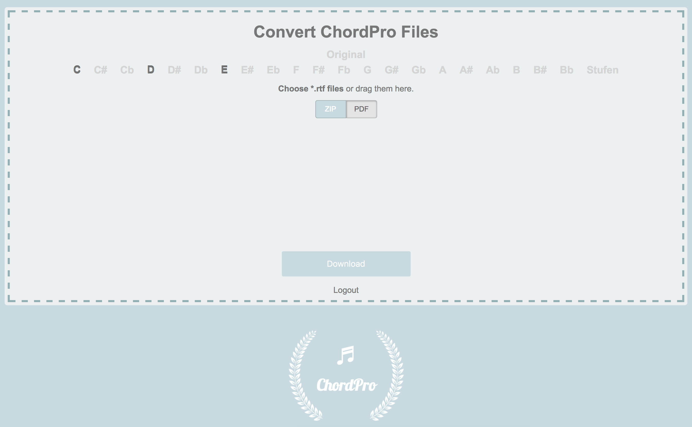

# ChordPro to PDF

Create your own, beautiful looking, one paged song sheets

  

  

## Run the app locally

1. [Install Python](https://www.python.org/downloads/)
2. Run `pip install -r requirements.txt`
3. cd into the app directory
4. (*optional:* create your own users)
    - Run `python tabledef.py`
    - Edit **create_users.py** with your users and passwords
    - Run `python create_users.py`
5. Run `python ChordProToPDF.py`
6. Access the running app in a browser at http://localhost:8080
7. Log in (default user: admin, password: admin)
8. Select **Man of sorrows - C.rtf** from the samples directory
